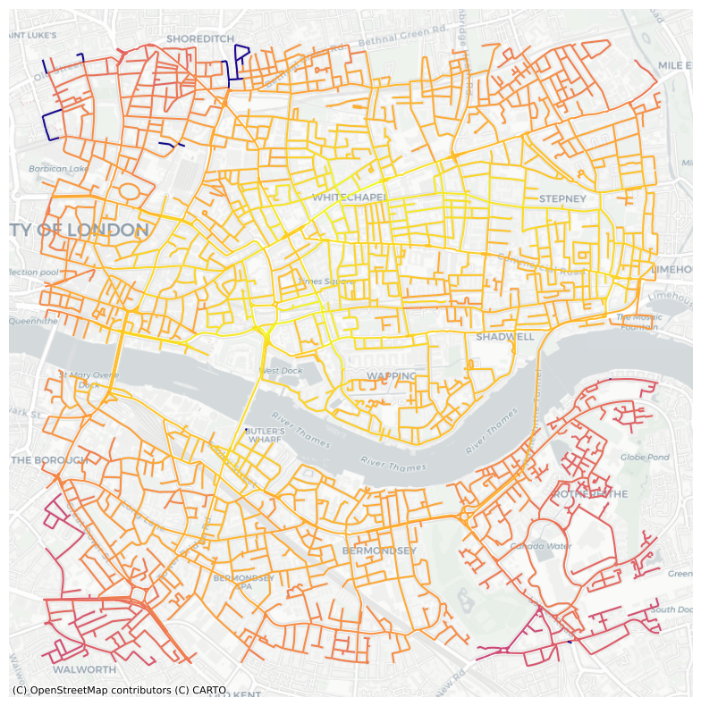
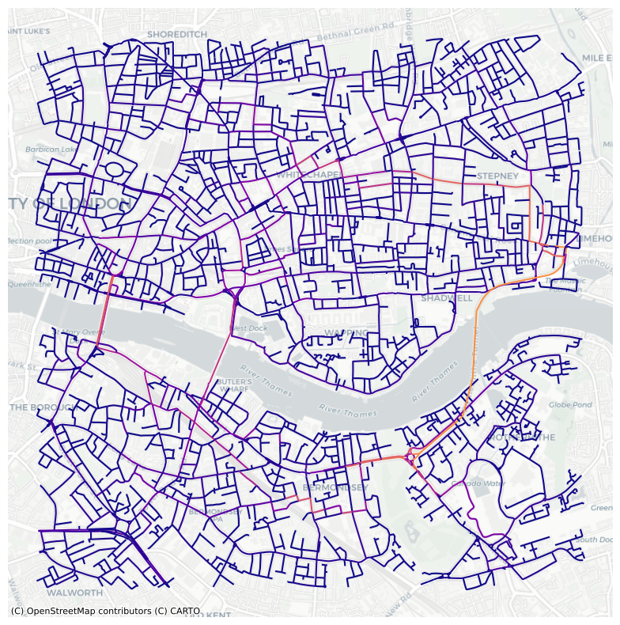
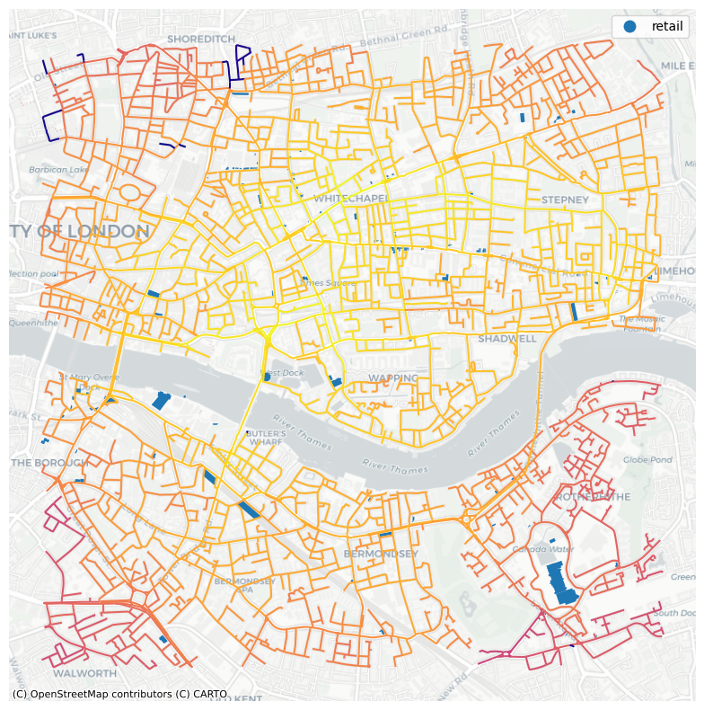
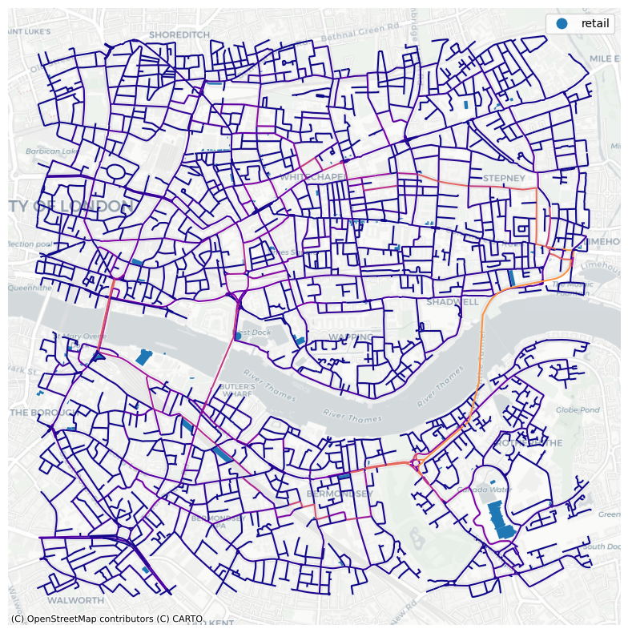

# Instruction

Question: 
How is the distribution of current retail establishments, and do they offer good accessibility?


```python
import numpy as np
import pandas as pd
import matplotlib
import matplotlib.pyplot as plt
import osmnx as ox 
import networkx as nx 
import matplotlib.cm as cm
import matplotlib.colors as colors
```

# Dataset

The street network dataset encompasses the area within a 2000-meter radius of London Dock. This is a 'drive network'.
Additionally, all relevant geometries within the network have been loaded to conduct the analysis.


```python
G=ox.graph_from_address('London Dock, London', dist=2000, network_type='drive')
# ox.plot_graph(G)
# G.edges(data=True)
```


```python
# some of the centrality measures are not implemented on multiGraph so first set as diGraph
DG = ox.get_digraph(G)
# nx.to_pandas_edgelist(G).head()
```


```python
# Convert the graph G to GeoDataFrames
gdf_nodes, gdf_edges = ox.graph_to_gdfs(G)

# Use the 'explore' method to create and display the map
Base_map = gdf_edges.explore(color='red')
# Base_map
```


```python
# get the geometries 
tags= tags={'amenity': True, 'highway':True, 'landuse':True, 'building':True, 'waterway': True, 'railway': True}
all_geom=ox.geometries.geometries_from_address('London Dock, London', tags, dist=2000)
all_geom = all_geom.to_crs(epsg=3857)
```

    /var/folders/ld/pth7mg7s14l5wgdlkxmx4hdm0000gn/T/ipykernel_26776/2672245919.py:3: UserWarning: The `geometries` module and `geometries_from_X` functions have been renamed the `features` module and `features_from_X` functions. Use these instead. The `geometries` module and function names are deprecated and will be removed in a future release.
      all_geom=ox.geometries.geometries_from_address('London Dock, London', tags, dist=2000)


# Analysis and visualisation


```python
# calculate edge closeness centrality: convert graph to a line graph so edges become nodes and vice versa
edge_cc = nx.closeness_centrality(nx.line_graph(DG))
# set or inscribe the centrality measure of each node as an edge attribute of the graph network object
nx.set_edge_attributes(DG,edge_cc,'cc')
G1 = nx.MultiGraph(DG)
```


```python
# convert graph to geopandas dataframe
gdf_edges = ox.graph_to_gdfs(G1,nodes=False,fill_edge_geometry=True)

# set crs to 3857 (needed for contextily)
gdf_edges = gdf_edges.to_crs(epsg=3857) # setting crs to 3857

# plot edges according to degree centrality
ax=gdf_edges.plot('cc',cmap='plasma',figsize=(10,10))

# add a basemap using contextilly
import contextily as ctx
ctx.add_basemap(ax,source=ctx.providers.CartoDB.Positron)
plt.axis('off')
plt.show()
```


    

    


```python
# similarly, calculate edge closeness centrality: convert graph to a line graph so edges become nodes and vice versa
edge_bc = nx.betweenness_centrality(nx.line_graph(DG))

# set or inscribe the betweenness centrality measure of each node as an edge attribute of the graph network object
nx.set_edge_attributes(DG,edge_bc,'bc')
G1 = nx.MultiGraph(DG)
```


```python
# convert graph to geopandas dataframe
gdf_edges = ox.graph_to_gdfs(G1,nodes=False,fill_edge_geometry=True)

# set crs to 3857 (needed for contextily)
gdf_edges = gdf_edges.to_crs(epsg=3857) # setting crs to 3857

# plot edges according to degree centrality
ax=gdf_edges.plot('bc',cmap='plasma',figsize=(10,10))

# add a basemap using contextilly
import contextily as ctx
ctx.add_basemap(ax,source=ctx.providers.CartoDB.Positron)
plt.axis('off')
plt.show()
```


    

    


```python
# Filter to include only retail buildings
retail_buildings = all_geom[all_geom['building'] == 'retail']
```


```python
fig,ax = plt.subplots(figsize=(10,10))
# all_geom[all_geom['building'].notna()].plot(ax=ax,color='black')
gdf_edges.plot(ax=ax, column='cc',cmap='plasma',figsize=(10,10))
retail_buildings[retail_buildings['building'].notna()].plot('building',
                                            ax=ax,
                                            categorical=True,
                                            legend=True)
# all_geom[all_geom['building'].notna()].plot('building',
#                                             ax=ax,
#                                             categorical=True,
#                                             legend=True)
import contextily as ctx
ctx.add_basemap(ax,source=ctx.providers.CartoDB.Positron)
plt.axis('off')
plt.show()
```


    

    


```python
fig,ax = plt.subplots(figsize=(10,10))
# all_geom[all_geom['building'].notna()].plot(ax=ax,color='black')
gdf_edges.plot(ax=ax, column='bc',cmap='plasma',figsize=(10,10))
retail_buildings[retail_buildings['building'].notna()].plot('building',
                                            ax=ax,
                                            categorical=True,
                                            legend=True)
# all_geom[all_geom['building'].notna()].plot('building',
#                                             ax=ax,
#                                             categorical=True,
#                                             legend=True)
import contextily as ctx
ctx.add_basemap(ax,source=ctx.providers.CartoDB.Positron)
plt.axis('off')
plt.show()
```


    

    


# Discussion

According to the closenness centrality map, most of the retails are distrubuted in the central of the neighbourhood, except for the big shopping mall in the southern-eastern corner, which indicated a poorer accessibility. This might be caused by the limited extent of the area.this is biased. additionaly, the betweenness centrality map illustrated that the big shopping mall has a relative good accessibility as there are more possibility the road nearby are went through 
